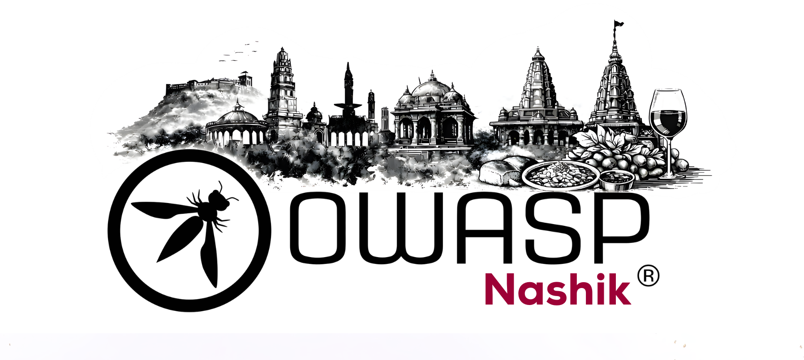

## Welcome
Welcome to the OWASP Nashik Chapter! We are a community of security enthusiasts, hackers, and developers passionate about application security.

### Upcoming Meetings
We schedule our meetings on the [OWASP Nashik Chapter Meetup](https://www.meetup.com/owasp-nashik-chapter/).

Our meetings are open to the public, and you do not need to be a member to attend. Please consider [joining OWASP](https://owasp.org/membership/) if you find our community, projects, and meetings valuable.

### Stay Connected
* **Mailing List:** Join our low traffic mailing list for event information.
* **Social:** Follow us on Twitter for updates.

### Short Links
* [OWASP Nashik Meetup](https://www.meetup.com/owasp-nashik-chapter/)

## Participation
The Open Worldwide Application Security Project (OWASP) is a nonprofit foundation that works to improve the security of software. All of our projects, tools, documents, forums, and chapters are free and open to anyone interested in improving application security.

Chapters are led by local leaders in accordance with the [Chapters Policy](/www-policy/operational/chapters). Financial contributions should only be made online using the authorized online donation button.

Everyone is welcome and encouraged to participate in our [Projects](/projects/), [Local Chapters](/chapters/), [Events](/events/), [Online Groups](https://groups.google.com/a/owasp.com/){:target='_blank'}, and [Community Slack Channel](https://owasp.slack.com/){:target='_blank'}. We especially encourage diversity in all our initiatives. OWASP is a fantastic place to learn about application security, to network, and even to build your reputation as an expert.

## Next Meeting/Event

